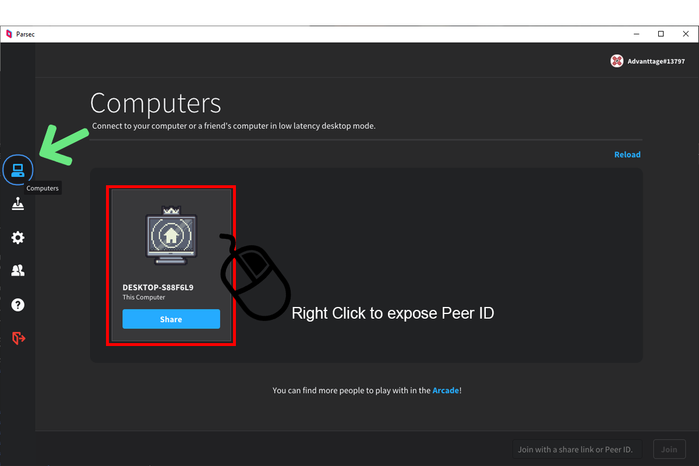
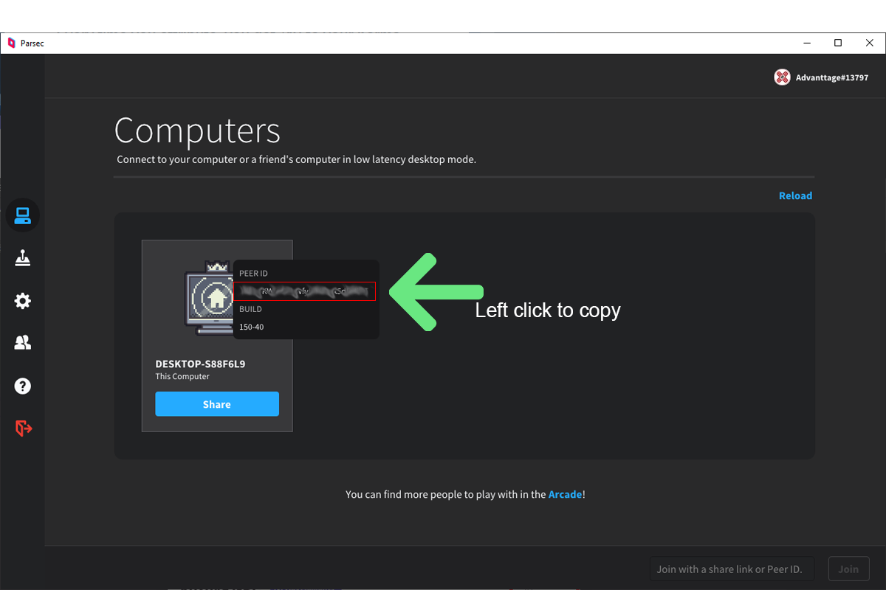

# A Parsec Integration With RetroPie Script


This is a script for integrating Parsec with RetroPie.
At the moment the script only supports the Carbon and Pixel Themes.

## Installation
First find out your Peer id by clicking on the Computers Tab in the Parsec app.


And right clicking on the Computer you want to connect to.  
Left clicking on the Peer ID will copy it.  
Write down the number if you like.  
***Warning***: the ID is case sensitive.  



Run the following command in the terminal:  
```bash
$ curl -fsSL https://raw.githubusercontent.com/Kozova1/Parsec-Integration-With-RetroPie/master/curlsetup.sh | sh
```
Follow the instructions on screen.  
After the script finishes it's work it's recommended to restart 'EmulationStation' or your Raspberry Pi.  
You should see a 'Parsec' console option in EmulationStation.  
Login with your [parsec](https://parsecgaming.com) account.  
Click Connect on your desired PC.  

# DISCLAIMER
1. I am not responsible for any loss of data, hardware etc. You take full responsibility.
2. Setup.sh alters your installation such that **future updates of RetroPie will not effect es_systems.cfg**.
> Note: in the future, you will have to manually update /home/pi/.emulationstation/es_systems.cfg, as it will not be overwritten by RetroPie updates.

## Credits:
- CBNathanael
- EmulationStation
- RetroPie Project
- DSandler
- advanttage
- [https://www.flaticon.com](flaticon.com):
	- Freepik - Right click, SH icons
	- Roundicons - Left Arrow icon designed by Roundicons from www.flaticon.com  
